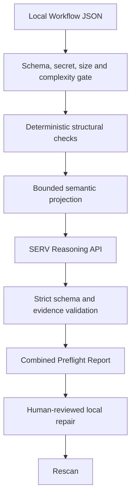

# Agent Preflight

> Agent Preflight uses SERV Reasoning to semantically review agent workflows before execution, combining bounded AI judgment with deterministic structural checks and human-controlled repairs.

Agent Preflight accepts a local OpenServ `WorkflowConfig` JSON file, proves graph facts deterministically, sends only a secret-safe semantic projection to SERV, and returns a combined report with exact evidence and local-only repair suggestions. It never connects to or mutates a live OpenServ workflow.

## Why SERV Reasoning is essential

A normal graph validator can prove that two nodes exist and an edge connects them. It cannot reliably determine whether a research brief satisfies a contract-execution task, whether required semantic prerequisites exist, whether explicitly declared permissions are justified by task intent, or whether important responsibilities contradict each other or have no owner.

SERV performs that central judgment from a bounded projection. Deterministic code remains the safety layer: it rejects unsafe input, resolves the graph, owns exact structural codes, validates SERV's schema and evidence references, and computes the final combined status. A full preflight is never represented as complete when SERV fails.

## Architecture



The semantic path uses `POST https://inference-api.openserv.ai/v1/chat/completions` through the OpenAI-compatible SDK. The default model is `gpt-5.4-mini`, reasoning effort is `low`, `temperature` is absent, timeout is 30 seconds, and SDK retries are disabled.

## Quick start

Requirements: Linux, Node.js 22.12 or newer, and npm 11 or newer.

```bash
npm ci
cp .env.example .env
# Set SERV_API_KEY in .env without committing it.
npm run dev
```

Open `http://127.0.0.1:8787`. Upload a JSON file or use one of the clearly labeled synthetic demo fixtures.

For a production-style local run:

```bash
npm run build
npm start
```

Production mode requires all usage-protection variables shown in `.env.example`; startup fails closed when they are missing or invalid.

## Environment variables

| Variable                                  | Purpose                                                    |
| ----------------------------------------- | ---------------------------------------------------------- |
| `SERV_API_KEY`                            | Server-only SERV credential; never exposed to browser code |
| `SERV_MODEL`                              | Server-controlled model; defaults to `gpt-5.4-mini`        |
| `SERV_RATE_LIMIT_WINDOW_SECONDS`          | Session/IP window                                          |
| `SERV_SESSION_REQUEST_LIMIT`              | Requests per anonymous session per window                  |
| `SERV_IP_REQUEST_LIMIT`                   | Requests per source IP per window                          |
| `SERV_GLOBAL_REQUEST_CAP`                 | Conservative daily request cap                             |
| `SERV_GLOBAL_SPEND_CAP_USD`               | Conservative daily reservation cap                         |
| `SERV_ESTIMATED_MAX_COST_PER_REQUEST_USD` | Spend reserved before each request                         |
| `PORT`                                    | Local server port, default `8787`                          |

Never prefix the key or model with `VITE_`; Vite-prefixed variables are browser-visible.

## Demo in about 30 seconds

1. Choose **Semantic mismatch** under Synthetic demos.
2. Observe that deterministic structural checks pass.
3. Select **Run SERV Preflight**.
4. Open the SERV evidence showing the research output cannot satisfy the contract-execution input.
5. Review the proposed local repair; it is visibly marked **Not applied**.
6. Load **Corrected control**, run SERV again, and receive `READY FOR REVIEW` only if the required semantic review succeeds.

The intended story is simple: the graph is valid, SERV sees that the workflow meaning is not, and the developer corrects only a local copy before execution.

## Quality commands

```bash
npm run format:check
npm run typecheck
npm test
npm run lint
npm run build
git diff --check
```

Automated tests mock the SERV transport and make no live requests. The implementation has also been manually verified once against the real SERV endpoint using the synthetic semantic-mismatch fixture.

## Supported input

The accepted native subset covers workflow `name`, `goal`, `agentIds`, `triggers`, `tasks`, and `edges`; task identity, assignment, descriptions, body, input expectations, dependencies, and output options; and manual, webhook, cron, and x402 trigger configuration. Unknown fields are rejected.

When `edges` is omitted, every trigger connects to the first task and tasks connect sequentially. An explicit `edges: []` remains empty. Dependencies are evidence and never create edges.

See [Architecture](docs/ARCHITECTURE.md), [Safety](docs/SAFETY.md), [Implementation contract](docs/IMPLEMENTATION_SPEC.md), and [Synthetic fixtures](fixtures/README.md).

## Privacy and safety

- Raw uploads remain in request memory and are not persisted.
- Secret-like input is rejected before any SERV request.
- Only bounded semantic evidence crosses the SERV boundary.
- One scan creates at most one SERV request; no automatic retry exists.
- Invalid or unavailable SERV output produces `SERV REVIEW INCOMPLETE`, never a pass.
- Reports omit raw uploads, prompts, responses, and credentials.
- Corrections affect only an in-memory working copy and always require human review.
- No OpenServ API, workflow execution, deployment, wallet, or mutation path exists.

## Honest limitations

- Agent Preflight reviews local configuration, not runtime behavior.
- Native `WorkflowConfig` does not expose a complete capability or permission inventory; SERV uses only explicit declarations in supplied task evidence and otherwise returns `insufficient_evidence`.
- A clean result means `READY FOR REVIEW`, not “safe to execute.”
- Public builder demand and the absence of a private OpenServ equivalent remain research risks.
- The included usage guard is intentionally single-instance. Multi-instance hosting requires a shared atomic counter store.
