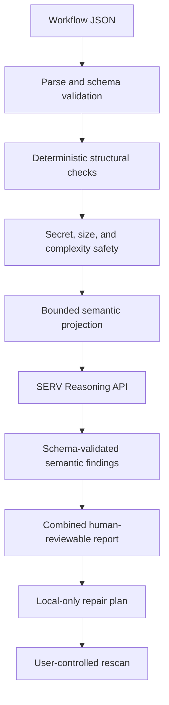

# Agent Preflight architecture

Agent Preflight is a SERV Reasoning-powered preflight reviewer for agent workflows. Deterministic validation protects the input boundary and proves graph facts; SERV supplies the central semantic judgment that graph validation cannot.

A completed preflight requires SERV. If SERV is unavailable, deterministic findings remain visible but the status is `SERV REVIEW INCOMPLETE`. The application never connects to or mutates a live OpenServ workflow.
